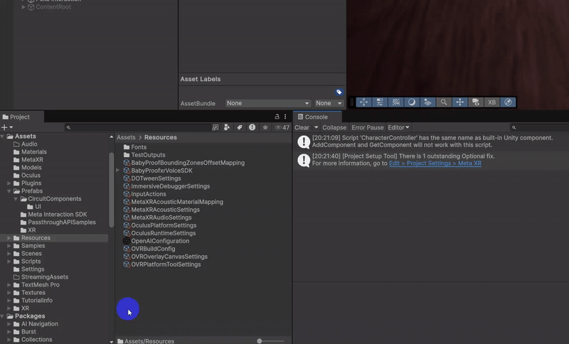
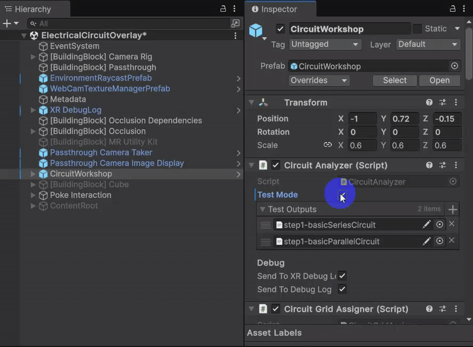

# Electric Circuitry on Paper - XR Prototype

## 🔗 Quick Links
- 🎥 [Demo Video](https://drive.google.com/drive/folders/1DpqpQhZ-8qEUeOk7zoXvyyg3w5n1P2eK?usp=sharing)
- 📑 [Pitch Slides](https://docs.google.com/presentation/d/1LsEf7hn1IQdoLrYC37tWsQS3RmQxMj75_3sOZfT_LSI/edit?slide=id.g3591e20ec8f_1_572)
- 🧪 [Prototype Template](https://docs.google.com/presentation/d/1xPvcyEnag4ImKNE3sgDFsOz5TSLzHkCcf3SfGvC89ek/edit?usp=sharing)
- 💾 [GitHub Repo](https://github.com/tiagomms/XRPrototyping-03-PaperDigitalOverlay)

## 🧠 Overview

This is my third one-week solo prototype for the XR Bootcamp XR Prototyping course (May–July 2025).

**"Electric Circuitry on Paper"** explores the idea of digital overlays on top of hand-drawn electric circuit diagrams. Inspired by Aaditya Vaze's hackathon demo, I built a system where camera frames are used to detect a circuit and augment it with editable parameters. Users can adjust component values (like resistors) and observe real-time feedback through the brightness of a digital lightbulb.

The core question: What happens when pen-and-paper educational tools become interactive through XR?

## Project Setup (to use ChatGPT integration)
1. Create your own OpenAIConfiguration file in the Resources folder. **Set the API Key value only (there is a bug when you set the other values)**.
2. Go to Scenes > ElectricalCircuitOverlay. Open CircuitWorkshop gameObject, change the CircuitAnalyzer script to **not test mode** and assign your OpenAIConfiguration file

## 🔧 Core Features

- Capture camera frame and display visual overlay
- Integrate ChatGPT for diagram parsing (block-level: battery, resistor, lightbulb, wire)
- Adjust resistor/lightbulb values through sliders
- Live update of lightbulb intensity based on parameter changes
- Support for switches and parallel circuits
- Working MR UI (although clunky)

## 🌟 Next Steps
- Hand Tracking (hand menu to take photos and place a camera frame)
- Design the idea on ShapesXR (right now my circuit workshop is too big)
- Occlusion vs no occlusion (test it out - again in ShapesXR)
- Improve MR UI (probably unifying canvas for changing instead of multiple canvas)
  - Read: https://developers.meta.com/horizon/documentation/unity/unity-isdk-direct-touch/ for starters
- Improve Formula layout for easier reading
- Enforce limits to avoid unrealistic values
- Support more complex components (transistors, condensors)
- Clean UI for sliders (log scale for resistors)
- Faster AI processing times: perhaps Unity Grok integration?
- Real overlay aligned on actual paper diagram

## 🧰 Tech Stack

- Meta XR SDK v77 (Camera Passthrough + Camera Access API)
- Unity (6.0 or later)
- Unity ChatGPT integration
- Occlusion

## 📚 Inspiration and References

- Aaditya Vaze's hackathon: https://www.linkedin.com/posts/aadityav_electronic-circuit-from-a-sketch-building-activity-7284585048605937665-_dhx
- Learnable Programming by Bret Victor: https://worrydream.com/LearnableProgramming/

## 🧪 Key Learnings

- First implementation of camera capture pipeline with ChatGPT vision input
- Challenges with image rectification and determining symbol position from AI
- Importance of prototyping flow before solving AI limitations
- Need for fallback logic (e.g., assuming component grid) for better reliability
- Vision models recognize *what* but not *where* — essential for diagram overlays
- Making Meta SDK MR UI is not easy

## ✅ What Worked

- Successful camera image capture
- AI interpretation of symbol types
- Creating electrical diagrams (and make the code for that to work and create wires that make sense)
- Pipeline from JSON to diagram interpretation (early proof)

## ⚠️ Challenges and What I'd Do Differently

- UI and interaction design came too late in the process
- Would prototype first, design second, AI basic prompt next
- Parallel and switch logic introduced complexity beyond week scope

## 🪪 License

This is a student prototype developed for educational purposes as part of XR Bootcamp. No production guarantees are provided.

MIT License